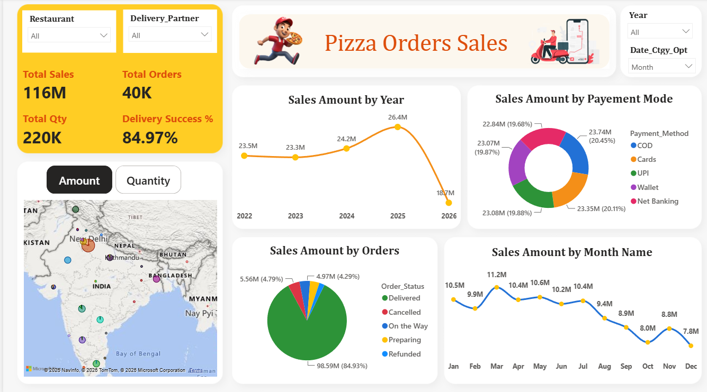

# 🍕 Pizza Orders Sales Power BI Dashboard

## 📊 Project Overview

This project is an interactive **Pizza Orders Sales Analytics Dashboard** developed using Microsoft Power BI.

The dashboard provides a business-focused view of pizza sales performance, customer orders, delivery performance, payment methods, order status, monthly sales trends, city-level performance, and year-to-date (YTD) analysis.

The goal of this project is to transform raw pizza order data into meaningful business insights through interactive dashboards, data modeling, DAX calculations, KPIs, slicers, and visual analytics.

---

## 🎯 Problem Statement

Pizza businesses generate large amounts of transactional data related to orders, customers, restaurants, delivery partners, payment methods, locations, and sales.

Analyzing this data manually can make it difficult to identify:

* Overall sales performance
* Year-over-year sales changes
* Monthly sales trends
* Top-performing cities
* Order status distribution
* Delivery success rate
* Customer and order volume
* Payment method contribution
* Current-period vs previous-period performance
* Product-level performance

The objective of this project is to create an interactive Power BI dashboard that helps business users monitor these KPIs and identify important sales trends.

---

## 📁 Dataset

The project uses a pizza orders dataset containing transactional information related to pizza sales and orders.

The dataset can contain fields related to:

* Order ID
* Customer ID
* Restaurant
* Delivery Partner
* Pizza Name
* City
* Order Date
* Quantity
* Sales Amount
* Payment Method
* Order Status
* Customer Gender
* Membership Type
* Other business dimensions

The dataset is transformed and modeled in Power BI before creating the dashboard.

> **Note:** If the original dataset contains sensitive or restricted information, use an anonymized or sample version before publishing it publicly on GitHub.

---

## 🛠️ Tools and Technologies

### Microsoft Power BI

Used for:

* Data transformation
* Data modeling
* DAX calculations
* Interactive visualizations
* KPI development
* Dashboard design
* Business intelligence analysis

### Power Query

Used for:

* Data cleaning
* Data transformation
* Data type conversion
* Column preparation
* Data preprocessing

### DAX

Used for:

* Sales calculations
* Quantity calculations
* Order calculations
* Growth calculations
* YTD analysis
* Previous-period analysis
* Dynamic dashboard calculations

### GitHub

Used for:

* Project version control
* Source-code/documentation management
* Dashboard sharing
* Project portfolio presentation

---

## 🔬 Methods

The project follows the following analytical workflow:

1. Import raw pizza order data.
2. Clean and transform the data using Power Query.
3. Create appropriate dimensions and fact tables.
4. Build relationships between tables.
5. Create a calendar/date dimension.
6. Develop DAX measures for business KPIs.
7. Create interactive slicers and filters.
8. Design KPI cards.
9. Create sales and order visualizations.
10. Develop YTD and period comparison analysis.
11. Validate dashboard calculations.
12. Publish the final dashboard and documentation.

---

# 📸 Dashboard Preview

## Dashboard Overview

The dashboard provides an executive-level overview of pizza sales performance.



### Main KPIs

The dashboard displays important KPIs such as:

* Total Sales
* Total Orders
* Total Quantity
* Delivery Success %
* YTD Sales
* Previous-Year Sales
* Growth %

---

## 📈 Dashboard Analysis

The dashboard includes multiple analytical views:

### Sales Amount by Year

Shows yearly sales performance and allows users to identify changes in annual sales.

### Sales Amount by Payment Mode

Displays the contribution of different payment methods such as:

* COD
* Cards
* UPI
* Wallet
* Net Banking

### Sales Amount by Order Status

Provides an overview of order statuses such as:

* Delivered
* Cancelled
* On the Way
* Preparing
* Refunded

### Sales Amount by Month

Shows monthly sales trends and helps identify high- and low-performing months.

### City-Level Sales

The dashboard provides geographical analysis and identifies top-performing cities.

### YTD Comparison

The dashboard compares current-period sales with previous-period sales and calculates sales growth.

---

# 🧩 Dashboard Model

The Power BI model is designed around transactional sales data and supporting dimensions.

A typical structure can include:

```text
                    ┌─────────────────────┐
                    │  Calendar Dimension │
                    └──────────┬──────────┘
                               │
                               │
┌──────────────────┐           ▼
│ Restaurant       │      ┌───────────────┐
│ Dimension        ├─────►│               │
└──────────────────┘      │ Orders / Sales│
                          │    Fact       │
┌──────────────────┐      │               │
│ Customer         ├─────►│               │
│ Dimension        │      └───────┬───────┘
└──────────────────┘              │
                                  │
┌──────────────────┐              │
│ Delivery Partner ├──────────────┤
│ Dimension        │              │
└──────────────────┘              │
                                  │
                         ┌────────▼────────┐
                         │ Other Dimensions│
                         │ City / Payment  │
                         │ Product / Status│
                         └─────────────────┘
```

The exact model should match the tables and relationships used in the `.pbix` file.

---

# 📊 Key Insights

Based on the dashboard preview, several important business insights can be identified.

### Sales Performance

The dashboard shows strong sales performance across multiple years, with yearly sales reaching approximately **26.4M in 2025** before declining in the displayed 2026 period.

### Order Volume

The overview shows approximately:

* **116M Total Sales**
* **40K Total Orders**
* **220K Total Quantity**
* **84.97% Delivery Success**

These KPIs provide a high-level view of business performance.

### Payment Methods

Sales are distributed across multiple payment methods including:

* COD
* Cards
* UPI
* Wallet
* Net Banking

This allows the business to understand customer payment preferences.

### Order Status

The order-status analysis shows that the majority of sales are associated with **Delivered** orders, while cancelled, preparing, on-the-way, and refunded orders represent smaller portions.

### City Performance

The dashboard highlights top-performing cities. In the displayed YTD analysis, **New Delhi** is the leading city, followed by cities such as Chennai, Hyderabad, Kolkata, and Mumbai.

### Monthly Trend

Monthly sales fluctuate throughout the year, making the monthly trend visualization useful for identifying peak and low-performing periods.

### YTD Growth

The second dashboard page provides current-period vs previous-period analysis and highlights sales growth using a combination of columns and a growth percentage line.

> Values shown above are based on the uploaded dashboard screenshots and may change when different slicers or filters are applied.

---

# ⭐ Dashboard Features

The dashboard contains several interactive features:

* Interactive year selection
* Date category selection
* Period selection
* Amount / Quantity toggle
* Restaurant filtering
* Delivery partner filtering
* Membership type filtering
* Customer gender filtering
* Sales category selection
* KPI cards
* Yearly sales analysis
* Monthly sales analysis
* Payment method analysis
* Order status analysis
* City-level geographical analysis
* Top 5 city analysis
* YTD analysis
* Current vs previous period comparison
* Sales growth percentage
* Product/pizza-level analysis
* Interactive Power BI filtering

---

# 📂 Project Structure

```text
pizza-orders-sales-powerbi-dashboard/
│
├── README.md
│
├── PowerBI/
│   └── Pizza_Orders_Sales_Dashboard.pbix
│
├── Dataset/
│   └── Pizza_Orders_Dataset.xlsx
│
├── Dashboard_Preview/
│   ├── Dashboard_Overview.png
│   └── Dashboard_YTD_Analysis.png
│
├── Documentation/
│   ├── Data_Model.png
│   └── DAX_Measures.md
│
└── LICENSE
```

---

# 📌 Result & Conclusion

The Pizza Orders Sales Power BI Dashboard converts raw transactional data into an interactive business intelligence solution.

The dashboard enables users to:

* Monitor sales KPIs
* Analyze order performance
* Track monthly and yearly trends
* Compare current and previous periods
* Analyze payment behavior
* Monitor delivery performance
* Identify high-performing cities
* Evaluate YTD performance
* Understand business growth

The project demonstrates practical skills in **Power BI, Power Query, DAX, data modeling, dashboard design, and business analytics**.

---

# 🚀 Future Work

Potential improvements include:

* Customer segmentation
* Customer lifetime value analysis
* Product profitability analysis
* Delivery-time analysis
* Restaurant performance ranking
* Customer retention analysis
* Advanced sales forecasting
* AI-powered insights
* Automated Power BI refresh
* Real-time sales monitoring
* Power BI Service deployment
* Row-level security
* Mobile dashboard optimization
* Automated reporting

---

# 👨‍💻 Author & Contact

**Author:** Vikash Chauhan

### Connect With Me

* GitHub: https://github.com/Vikashchauhan-dev
* LinkedIn: https://www.linkedin.com/in/vikashchauhan01
* Email: Vikashchauhan10211@gmail.com

---

## 📜 License

This project is intended for educational, portfolio, and data analytics demonstration purposes.

If you use external datasets, check and follow the dataset's original license and usage requirements.
